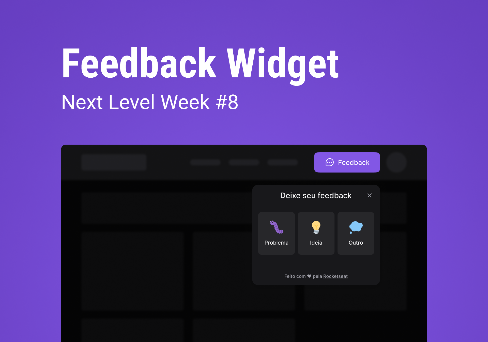

<section align="center">
    
</section>

<h2 align="center">Summary</h2>

<p align="center">
    <a href="#about">📙 About</a>
    <!-- <a href="#preview">🖼️ Preview</a> -->
    <a href="#start">📖 How to Start</a>
    <a href="#features">💡 Features</a>
    <a href="#technologies">💻 Technologies</a>
</p>

<h4 align="center">
   🚧 FeedGet Project on progress... 🚧
</h4>

<H2 id="about">📙 About</H2>

<p><strong>Feedget</strong> is a useful widget to implement on any application that needs a support area with submit forms. The main feature is that it allows the user to insert the screenshot of the error screen at the moment and send it with the form text when submitted. In addiction, this app is totally well planned for accessibility as well.</p>
<p>The <strong>Next Level Week</strong> is a whole week coding event based on the development of a complete application using some of the most used tools available on the JavaScript Stack, such as Tailwind, React and React Native. The purpose is all about keep learning, sharing the challenges with other student, making networking and improving on your hard and soft skills.</p>
<p>This project is originally created on Ignite from <a href="https://www.rocketseat.com.br/">Rocketseat</a> and made by <a href="https://www.linkedin.com/in/kleverson-kenji-iwatani/">Kenji Iwatani</a></p>

<!-- ---

<H2 id="preview">🖼️ Preview</H2>

<section align="center">
    
</section> -->

---

<H2 id="start">📖 How to Start</H2>

<h3>Starting this repository:</h3>

```bash
# Clone this repository
$ git clone https://github.com/iwataniKenji/feedget

# Access the project directory
$ cd feedget

# Install dependencies
$ npm install

# Initialize and open local host
$ npm run dev
```

---

<H2 id="features">💡 Features</H2>

- [x] Declarative interface with Tailwind
- [x] Screenshot usage on forms
- [x] Accessibility for keyboard only
- [x] Communication between components through props
- [x] Loading spinner

---

<H2 id="technologies">💻 Technologies</H2>

- [x] <a href="https://vitejs.dev/">Vite</a>
- [x] <a href="https://reactjs.org/">React</a>
- [x] <a href="https://www.typescriptlang.org/">Typescript</a>
- [x] <a href="https://tailwindcss.com/">Tailwindcss</a>
- [x] <a href="https://phosphoricons.com/">Phosphor Icons</a>

